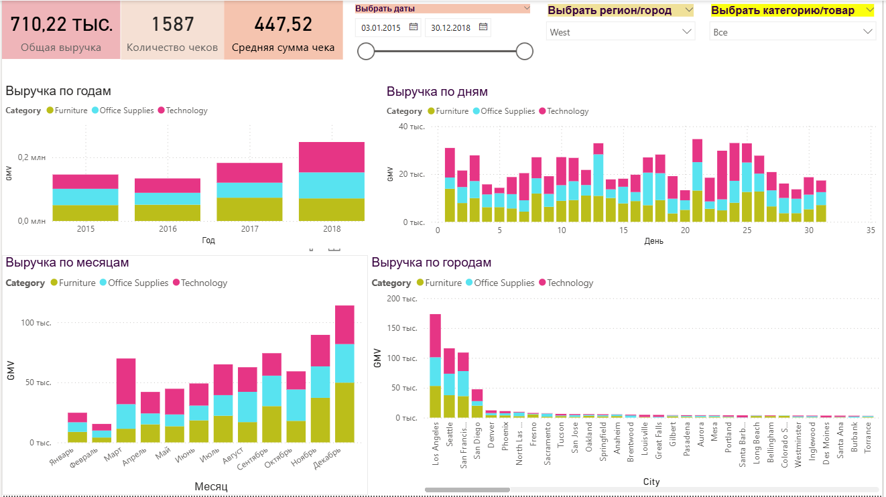
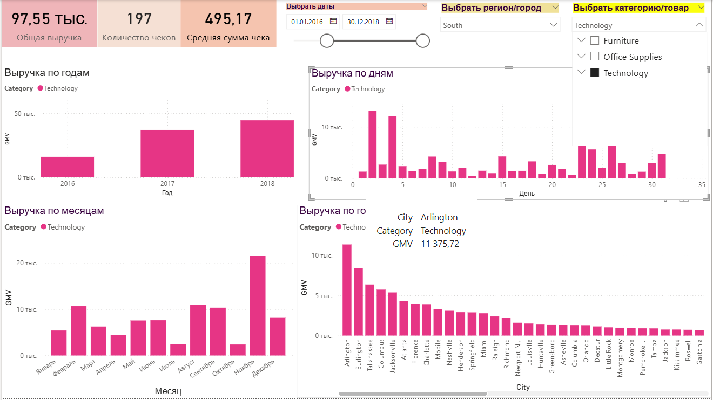

# 📊 Дашборд KPI розничных продаж (Power BI).

Интерактивный дашборд для мониторинга ключевых метрик розничных продаж на основе датасета Superstore (заказы, категории, регионы, даты, выручка).

## Цель проекта:

Разработать BI‑дашборд, который позволяет быстро ответить на стратегические вопросы менеджера розничной торговли:
- Какова текущая общая выручка (GMV), количество чеков и средний чек за выбранный период?
- Как менялась выручка по годам и месяцам? Видна ли сезонность?
- Какие категории товаров вносят наибольший вклад в выручку?
- В каких городах продажи выше/ниже среднего?
- Как меняются метрики при фильтрации по датам, регионам и категориям?

## 📦 Данные:
- Источник: учебный датасет Sample Superstore (2015–2018).
- Размер: 9994 записей о заказах.
- Основные поля:
    - Order Date — дата заказа
    - Order ID — идентификатор заказа
    - Category, Sub-Category — категории товаров
    - Region — географический регион
    - Sales — выручка по позиции
    - Quantity — количество единиц

## 📐 Ключевые метрики (Measures).
В Power BI определены следующие DAX‑меры:

GMV := SUM(superstore[Sales])  
    Общая выручка за выбранный период (в т.ч. с учётом фильтров).

Orders Count := DISTINCTCOUNT(superstore[Order ID])  
    Количество уникальных заказов — важно для понимания объёма операций.

AOV := DIVIDE([GMV], [Orders Count])  
    Средний чек (Average Order Value) — выручка в расчёте на одну сделку.

## 🖼 Архитектура дашборда
Одна страница отчёта с единой цветовой схемой.

Верхняя панель: 
KPI‑карточки:
Три информационных карточки с крупными числами:
- Общая выручка (GMV) за выбранный период.
- Количество чеков (число заказов) за выбранный период.
- Средняя сумма чека (AOV) за выбранный период.
Карточки обновляются в реальном времени при выборе в срезах-фильтрах.

Левая колонка: Динамика выручки
- Выручка по годам  
    - Показывает рост/снижение выручки год от года.
    - Цветовая заливка отражает вклад категорий в общий объём по каждому году.
- Выручка по месяцам  
    - Выявляет сезонные паттерны внутри года.
    - Видны месяцы‑пики и провалы, особенно при фильтрации по отдельной категории или региону.  

Правая колонка: детализация  
- Выручка по дням (столбчатая диаграмма).  
  - Даёт помесячный/календарный профиль продаж: всплески и «тихие» дни.  
- Выручка по городам (столбчатая диаграмма).  
  - Показывает топ‑города по выручке и «длинный хвост» менее успешных локаций.  
  - Удобно искать города‑лидеры и точки роста.

Фильтры (срезы):
Три интерактивных среза в верхней части:
- Выбрать даты — ползунок/диапазон с фиксированным началом и концом.
- Выбрать регион/город — выпадающий список для выбора нужного региона и города.  
- Выбрать категорию/товар — чекбоксы по категориям и товару для анализа отдельных сегментов.

Все визуалы реагируют на срезы — меняются тут же, позволяя анализировать KPI для конкретных комбинаций периодов, регионов и товаров.

## 🗂 Структура репозитория  

`data/superstore.csv` — исходный датасет (9994 записей)  
`reports/retail_kpi_dashboard.pbix` — файл Power BI (главный артефакт)  
`screenshots/dash.jpg` — общий вид дашборда  
`screenshots/category.jpg` — пример работы срезов    
`README.md` — этот файл  

## 🚀 Как использовать:
Требования:
- Power BI Desktop (версия от 2024 года или свежее).
- Windows 10/11 или macOS.

Шаги запуска:
- Клонируй/скачай репозиторий:  

    git clone https://github.com/irochkairochka/retail-kpi-dashboard-superset.git  
    cd retail-kpi-dashboard-superset  

- Открой файл reports/retail_kpi_dashboard.pbix в Power BI Desktop.
- Датасет загрузится автоматически (ссылка на data/superstore.csv уже конфигурирована).
- Интерактивный дашборд готов к использованию:
    - Используй срезы в верхней части для фильтрации.
    - Смотри, как меняются KPI и диаграммы.

## 📊 Примеры инсайтов
На основе дашборда можно быстро выявить:
1. Сезонность: в большинстве лет пики выручки приходятся на конец года (осень–зима), по месяцам заметен рост к ноябрю–декабрю.  
2. Категории: при выборе всех категорий Technology даёт наибольший вклад в GMV, Furniture и Office Supplies заметно меньше.  
3. География: выручка по городам сильно концентрируется в нескольких лидирующих точках (топ‑города сильно обгоняют «длинный хвост» мелких локаций).  
4. Поведение внутри сегмента: при фильтрации по одной категории (например, Technology) меняется как общая выручка, так и распределение по месяцам и городам — можно отдельно анализировать сильные/слабые регионы именно для выбранной категории.  

Пример анализа (скрин #2)  
- Выручка по годам показывает рост 2016 → 2017 → 2018, максимум в 2018.    
- По месячной динамике видно выраженные всплески в отдельные месяцы (акции/сезонные кампании) и провалы в межсезонье.  
- Топ‑города внутри South дают основную часть выручки по Technology, остальные локации слабее.    

## 🛠 Технологический стек
- Power BI Desktop — BI‑инструмент, визуалы, DAX‑меры.
- DAX (Data Analysis Expressions) — язык формул для вычисления метрик.
- CSV — формат источника данных.

## 📝 Разработка и возможные улучшения
Текущая версия покрывает основные KPI. Возможные расширения:
-  Вторая страница: анализ клиентов (топ‑клиенты, RFM‑сегментация).
-  Карточка «Топ 3 товара по выручке» с использованием TOPN().
- Связь с live-источником (SQL Server, PostgreSQL) вместо CSV.
- Анализ рентабельности (добавить поле Profit и метрику маржинальности).
- Сравнение периодов (YoY, MoM) через DAX‑функции.

## 📧 Контакты:
Разработчик: Ирина Васильевна  
📧 Email: irochkavinokurova@mail.ru  
📱 WhatsApp/Telegram: +7 (919) 128-29-95  

## 📄 Лицензия
Проект использует открытый датасет Sample Superstore от Kaggle.com.  

## 📸 Галерея дашборда  

### Главный вид (полный период 2015–2018)  

  

**На скрине видно**:
- Общие KPI в верхней панели (GMV, Orders Count, AOV).
- Четыре диаграммы (по годам, месяцам, дням и городам).
- Фильтры-срезы для интерактивного анализа.  

### Пример фильтрации    

  

**На скрине**: Комбинированный фильтр (регион + категория) показывает как меняются годовая, месячная и дневная динамика, а также распределение выручки по городам для выбранного сегмента. 
