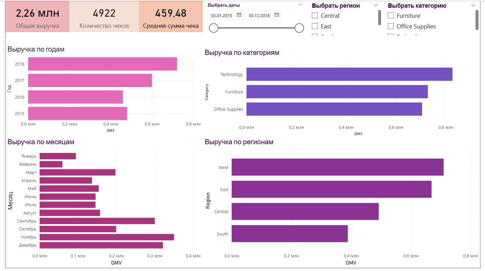
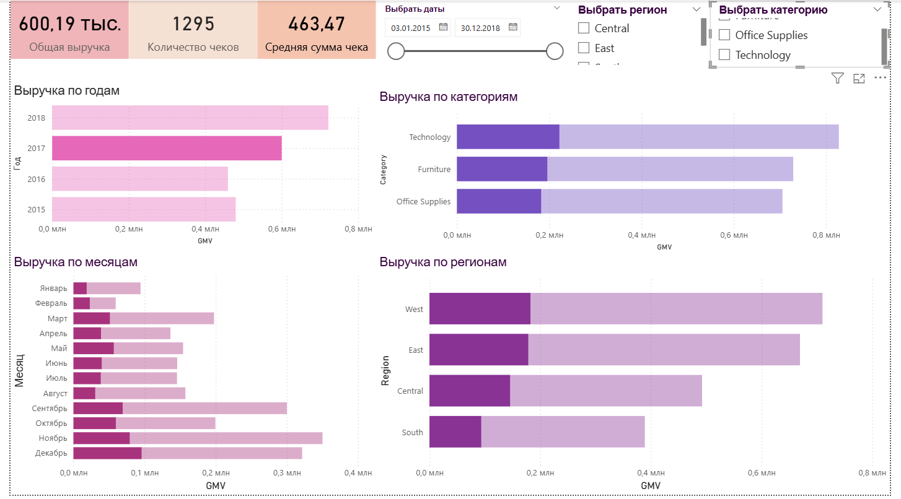
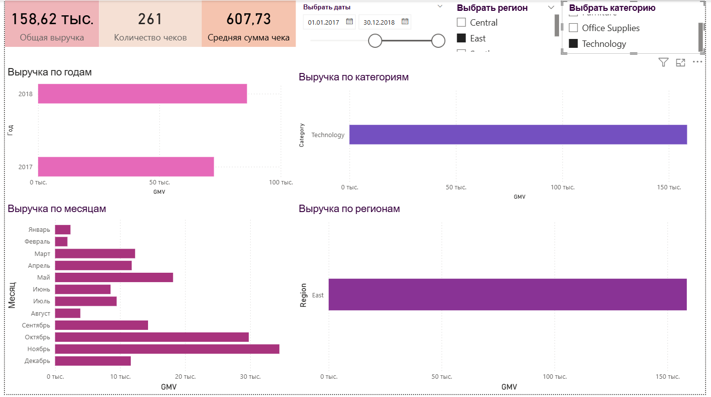

# 📊 Дашборд KPI розничных продаж (Power BI).

Интерактивный дашборд для мониторинга ключевых метрик розничных продаж на основе датасета Superstore (заказы, категории, регионы, даты, выручка).

## Цель проекта:

Разработать BI‑дашборд, который позволяет быстро ответить на стратегические вопросы менеджера розничной торговли:
- Какова текущая общая выручка (GMV), количество чеков и средний чек за выбранный период?
- Как менялась выручка по годам и месяцам? Видна ли сезонность?
- Какие категории товаров вносят наибольший вклад в выручку?
- В каких регионах продажи выше/ниже среднего?
- Как меняются метрики при фильтрации по датам, регионам и категориям?

## 📦 Данные:
- Источник: учебный датасет Sample Superstore (2015–2018).
- Размер: 9994 записей о заказах.
- Основные поля:
    - Order Date — дата заказа
    - Order ID — идентификатор заказа
    - Category, Sub-Category — категории товаров
    - Region — географический регион
    - Sales — выручка по позиции
    - Quantity — количество единиц

## 📐 Ключевые метрики (Measures).
В Power BI определены следующие DAX‑меры:

GMV := SUM(superstore[Sales])  
    Общая выручка за выбранный период (в т.ч. с учётом фильтров).

Orders Count := DISTINCTCOUNT(superstore[Order ID])  
    Количество уникальных заказов — важно для понимания объёма операций.

AOV := DIVIDE([GMV], [Orders Count])  
    Средний чек (Average Order Value) — выручка в расчёте на одну сделку.

## 🖼 Архитектура дашборда
Одна страница отчёта с единой цветовой схемой.

Верхняя панель: 
KPI‑карточки:
Три информационных карточки с крупными числами:
- Общая выручка (2.26 млн — полный период)
- Количество чеков (4922 заказа)
- Средняя сумма чека (459.48)
Карточки обновляются в реальном времени при выборе в срезах.

Левая колонка: Динамика выручки
- Выручка по годам (горизонтальная столбчатая диаграмма)
    - Показывает рост/снижение выручки год от года.
    - Видно, что 2018 — максимум.
- Выручка по месяцам (горизонтальная столбчатая диаграмма)
    - Выявляет сезонные паттерны.
    - Пики в сентябре–декабре (новогодний сезон?).
    - Провал в феврале.  
Правая колонка: Структура выручки
- Выручка по категориям (горизонтальная столбчатая диаграмма)
    - Категории: Technology (техника), Furniture (мебель), Office Supplies (канцелярия).
    - Technology и Furniture почти равны и доминируют.
- Выручка по регионам (горизонтальная столбчатая диаграмма)
    - Регионы: West, East, Central, South.
    - West и East примерно в 2x раза больше, чем Central и South.

Фильтры (срезы):
Три интерактивных среза в верхней части:
- Выбрать даты — ползунок/диапазон с фиксированным началом и концом.
- Выбрать регион — чекбоксы для мультиселекта.
- Выбрать категорию — чекбоксы для мультиселекта.

Все визуалы реагируют на срезы — меняются тут же, позволяя анализировать KPI для конкретных комбинаций периодов, регионов и товаров.

## 🗂 Структура репозитория  

`data/superstore.csv` — исходный датасет (9994 записей)  
`reports/retail_kpi_dashboard.pbix` — файл Power BI (главный артефакт)  
`screenshots/kpi_dashboard.jpg` — общий вид дашборда  
`screenshots/srezy_kpi_dashboard.jpg` — пример работы срезов  
`screenshots/klick_kpi_dashboard.jpg` — пример детальной выборки   
`README.md` — этот файл  

## 🚀 Как использовать:
Требования:
- Power BI Desktop (версия от 2024 года или свежее).
- Windows 10/11 или macOS.

Шаги запуска:
- Клонируй/скачай репозиторий:  

    git clone https://github.com/irochkairochka/retail-kpi-dashboard-superset.git  
    cd retail-kpi-dashboard-superset  

- Открой файл reports/retail_kpi_dashboard.pbix в Power BI Desktop.
- Датасет загрузится автоматически (ссылка на data/superstore.csv уже конфигурирована).
- Интерактивный дашборд готов к использованию:
    - Используй срезы в верхней части для фильтрации.
    - Смотри, как меняются KPI и диаграммы.

## 📊 Примеры инсайтов
На основе дашборда можно быстро выявить:
1. Сезонность: Выручка растёт к концу года (сентябрь–декабрь).
2. Категории: Technology и Furniture примерно поровну, Office Supplies отстаёт в 1.5–2 раза.
3. Регионы: West и East — флагманские регионы. Central и South требуют внимания.
4. Качество сделок: AOV ~460 руб. — стабилен, не зависит от региона.

Пример анализа (скрин #3)  
Фильтр: Период 2017-2018 + East-регион + Technology.  
    - Выручка резко упала с 2.26M до 158K.  
    - Количество чеков снизилось с 4922 до 261.  
    - Средний чек вырос с 459 до 607 → товар более дорогой по сравнению с другими категориями.  

## 🛠 Технологический стек
- Power BI Desktop — BI‑инструмент, визуалы, DAX‑меры.
- DAX (Data Analysis Expressions) — язык формул для вычисления метрик.
- CSV — формат источника данных.

## 📝 Разработка и возможные улучшения
Текущая версия покрывает основные KPI. Возможные расширения:
-  Вторая страница: анализ клиентов (топ‑клиенты, RFM‑сегментация).
-  Карточка «Топ 3 товара по выручке» с использованием TOPN().
- Связь с live-источником (SQL Server, PostgreSQL) вместо CSV.
- Анализ рентабельности (добавить поле Profit и метрику маржинальности).
- Сравнение периодов (YoY, MoM) через DAX‑функции.

## 📧 Контакты:
Разработчик: Ирина Васильевна  
📧 Email: irochkavinokurova@mail.ru  
📱 WhatsApp/Telegram: +7 (919) 128-29-95  

## 📄 Лицензия
Проект использует открытый датасет Sample Superstore от Kaggle.com.  

## 📸 Галерея дашборда  

### Главный вид (полный период 2015–2018)  

  

**На скрине видно**:
- Общие KPI в верхней панели (GMV, Orders Count, AOV).
- Четыре диаграммы (по годам, месяцам, категориям, регионам).
- Фильтры-срезы для интерактивного анализа.  

### Пример фильтрации по клику  

  

**На скрине**: Выбран только 2017 год, видно как этот год отражается в общей валовой выручке за весь период данных (2015-2018).  

### Детальная выборка (Period + East + Technology)  

 

**На скрине**: Комбинированный фильтр (период 2017-2018 + регион East + категория Technology) показывает узкий срез данных.  
